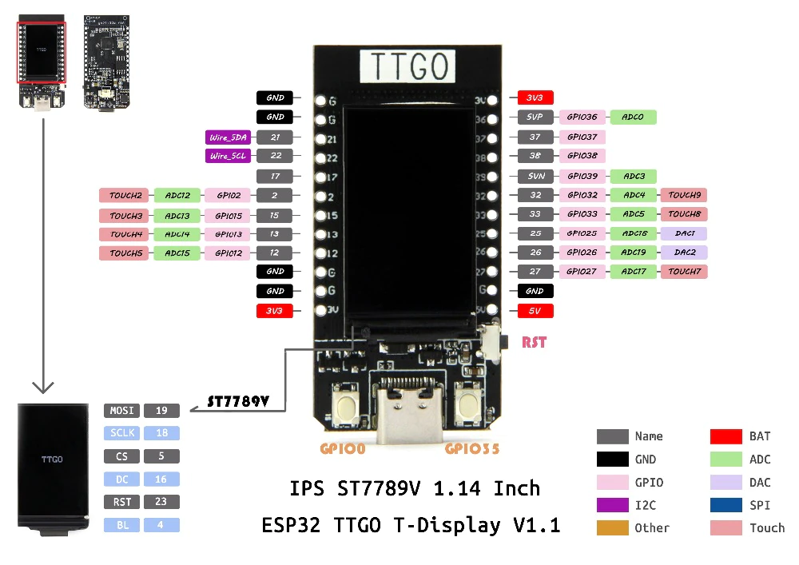

# micropython-lilygo-ttgo-experiments

Playing with a nice esp32 board


# Preparar TTGO T-Display de Lilygo

Es la plaquita que compré en mercado libre, que dice TTGO grande en una punta:

https://articulo.mercadolibre.com.ar/MLA-903603771-modulo-desarrollo-ttgo-esp32-display-1-14p-usb-c-wifi-4mb-_JM#backend=item_decorator&backend_type=function&client=bookmarks-polycard



Primero bajar este repo:
https://github.com/russhughes/st7789_mpy

Y buscar firmware en `[EL REPO]/firmware/T-DISPLAY/`.

Instalar Thonny en un virtualenv (https://thonny.org/):

```
pip install thonny
```

Abrir Thonny (corriendo `thonny` en el venv), ir a Tools > Options > Interpreter. Elegir en el combo "Micropython ESP32" y el puerto donde se ve la plaquita (desconectar todo lo que se pueda de la máquina así está claro que es esa, probar desconectar a ver si desaparece, etc).

Click en "Install or update firmware". Volver a elegir el puerto. Elegir el firmware antes encontrado en los pasos de clonar el repo. Elegir opción "From image file (keep)", y tildar "Erase flash before installing".

Click en Install y esperar. Después cerrar las opciones.

El intérprete en la pantalla principal ahora debería estar corriendo en la plaquita. Probar en la consola alguno de los ejemplos de `./ejemplos/cosas_basicas.py`.

# Correr y guardar scripts

Desde thonny se pueden correr los scripts directamente con el botón de play. 
Pero para que el script quede guardado y corra solo sin necesidad de la pc conectada, hay que guardarlo en la plaquita con nombre `main.py`.
Hay tools para hacer esto por consola, tengo que investigarlas así uso vim y listo.
